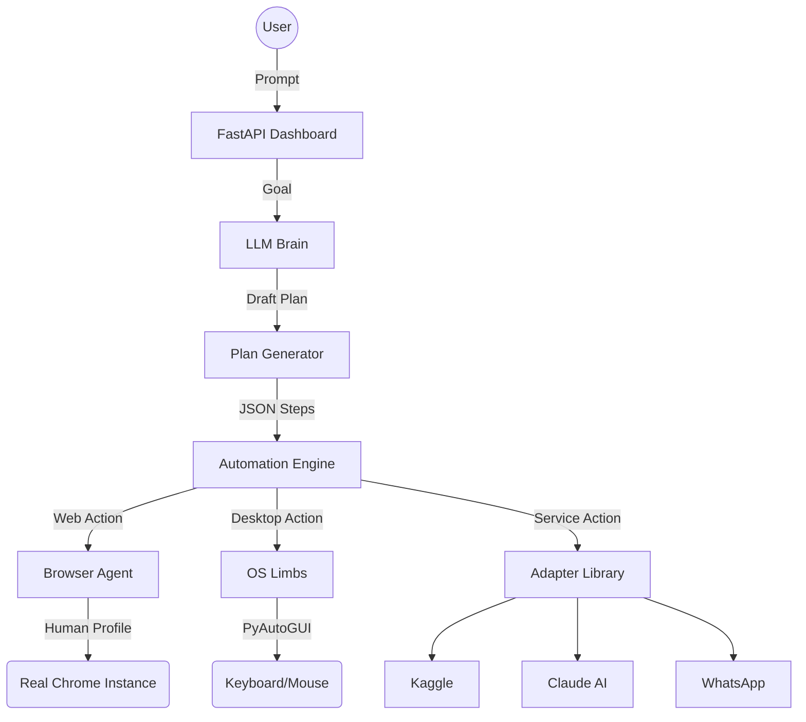

# 🤖 Autobot: The Future of Sovereign Automation

Welcome to the **Autobot** mission control. This project is not just a collection of scripts; it is an ambitious attempt to build a **sovereign digital agent**—a system with a brain (LLM) and real physical limbs (Browser/Keyboard/Mouse) that can navigate the digital world exactly like a human being.

---

## 🎯 The Vision
Most automation today is "brittle." It breaks when a button moves 5 pixels. It fails when it hits a login screen. Our vision is to create an agent that **thinks before it clicks**:
- **Human-Parallelism:** Navigating using a real Chrome profile with real cookies and real passwords.
- **Visual Intelligence:** Using `browser_snapshot` to "see" the UI tree and `screenshot` to verify actions.
- **Multi-Phase Planning:** Breaking complex goals (like entering a Kaggle competition) into 30+ granular, verifiable steps.
- **Local Sovereignty:** Running entirely on your machine, with your data, using your tools.

---

## 🚀 Current Milestone: "The Limb Alignment"
We have achieved a stable core architecture, but we are in the "Active Debugging" phase.

### What works:
- ✅ **The Brain:** Multi-provider LLM integration (OpenRouter/X.ai) with deep planning (30-step depth).
- ✅ **The Limbs:** `human_profile` mode using PyAutoGUI to simulate literal keyboard/mouse events.
- ✅ **The Dashboard:** A real-time Command Center on port 3000 to monitor logs and active runs.
- ✅ **Adapters:** Specialized connectors for Kaggle, Claude, WhatsApp, and more.
- ✅ **Discovery:** `browser_snapshot` allows the AI to read the interactive structure of any page.

### Known Bugs (Active Firefighting):
- 🛡️ **Adapter Precision:** The AI sometimes forgets to specify the `adapter` name. We have implemented **Mission Critical Guards** in the engine to stop these crashes and force the AI to self-correct.
- 🕒 **Dynamic Loading:** Some sites (like Kaggle) load slowly. We are training the AI to use `wait` steps and `browser_snapshot` loops to handle lag.
- 📐 **Windowing:** Automation windows were sometimes splitting or losing focus. We've added `--start-maximized` to enforce a clean workspace.

---

## 🏗️ Technical Architecture

---

## 🛠️ Setup & Execution
1. **Bootstrap:** `python -m autobot.main` (Starts server on 8000).
2. **Dashboard:** `npm run dev` in `/frontend` (Opens dashboard on 3000).
3. **Configurations:** 
   - Set `AUTOBOT_BROWSER_MODE=human_profile` for stealth.
   - Set `AUTOBOT_LLM_PROVIDER=openrouter` for the brain.

---

## 🗺️ Roadmap
- [ ] **Conversational Follow-ups:** Allow users to update plans via chat mid-run.
- [ ] **OCR Integration:** Let the AI "read" text directly from pixel screenshots.
- [ ] **Self-Healing:** Automatically try alternative selectors if a click fails.
- [ ] **Collective Intelligence:** Sharing successful workflows via a local JSON library.

---
*Created by the Autobot Core Team. Sovereignty through Automation.*
