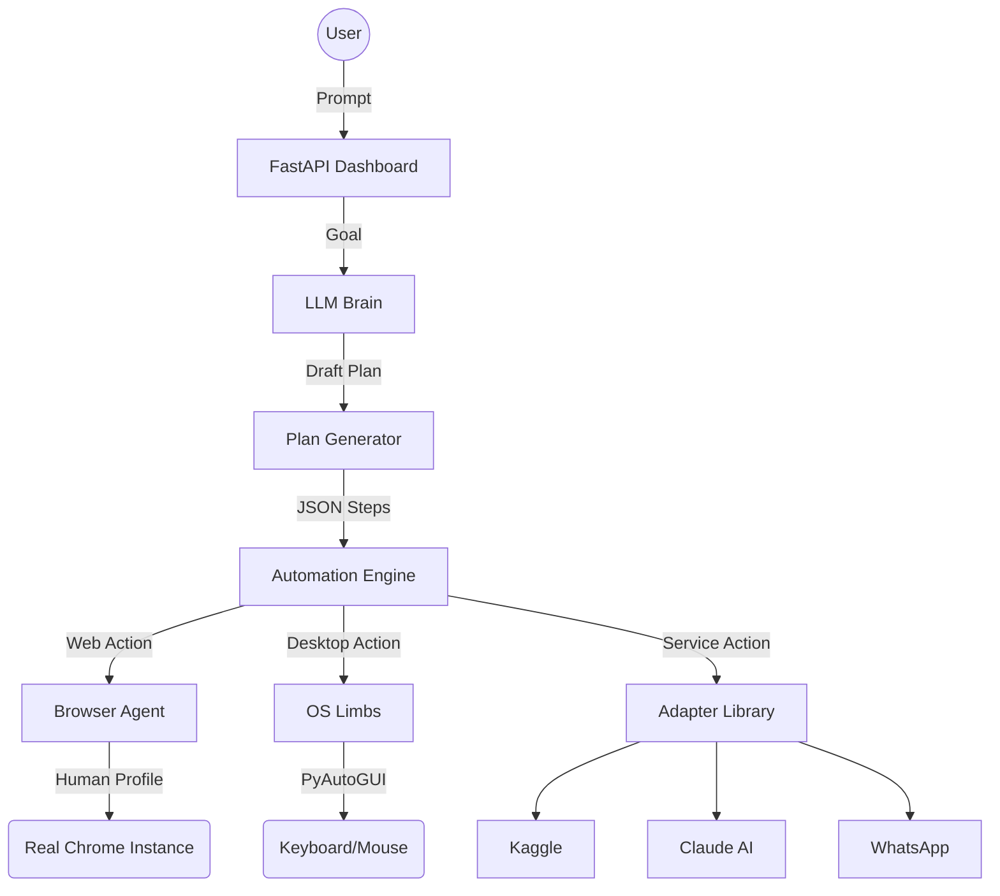

# 🤖 Autobot: The Future of Sovereign Automation

Welcome to the **Autobot** mission control. This project is not just a collection of scripts; it is an ambitious attempt to build a **sovereign digital agent**—a system with a brain (LLM) and real physical limbs (Browser/Keyboard/Mouse) that can navigate the digital world exactly like a human being.

---

## 🎯 The Vision
Most automation today is "brittle." It breaks when a button moves 5 pixels. It fails when it hits a login screen. Our vision is to create an agent that **thinks before it clicks**:
- **Human-Parallelism:** Navigating using a real Chrome profile with real cookies and real passwords.
- **Visual Intelligence:** Using `browser_snapshot` to "see" the UI tree and `screenshot` to verify actions.
- **Multi-Phase Planning:** Breaking complex goals (like entering a Kaggle competition) into 30+ granular, verifiable steps.
- **Local Sovereignty:** Running entirely on your machine, with your data, using your tools.

---

## 🚀 Current Milestone: "The Sovereign Hand"
We have achieved a highly robust, unified architecture. The system is now ready for autonomous execution with minimal supervision.

### What works:
- ✅ **Unified Control:** A single `autobot --server` command handles both backend and frontend.
- ✅ **Extension Mastery:** Real-time visual "Mini-Peek" overlay that tracks the agent across all tabs.
- ✅ **Kaggle Baseline:** Native API support for listing, downloading, and submitting to Kaggle competitions.
- ✅ **Resilient Loops:** Intelligent API-to-UI fallback ensures the agent doesn't give up if an API fails.
- ✅ **OS "Muscles":** Anti-sleep prevention and direct mouse/keyboard control for sites that block automation.

### Robustness Features:
- 🛡️ **Self-Healing:** The agent is instructed to switch from API mode to manual Browser mode if tools fail.
- 🕒 **Background Persistence:** The browser extension syncs state via a background worker, allowing you to monitor progress even if you close the dashboard.
- 📐 **Unified Setup:** `autobot --setup` automatically handles browser installations and environment checks.

---

## 🏗️ Technical Architecture

---

## 🛠️ Setup & Execution
1. **Bootstrap:** `python -m autobot.main` (Starts server on 8000).
2. **Dashboard:** `npm run dev` in `/frontend` (Opens dashboard on 3000).
3. **Configurations:** 
   - Set `AUTOBOT_BROWSER_MODE=human_profile` for stealth.
   - Set `AUTOBOT_LLM_PROVIDER=openrouter` for the brain.

---

## 🗺️ Roadmap
- [ ] **Conversational Follow-ups:** Allow users to update plans via chat mid-run.
- [ ] **OCR Integration:** Let the AI "read" text directly from pixel screenshots.
- [ ] **Self-Healing:** Automatically try alternative selectors if a click fails.
- [ ] **Collective Intelligence:** Sharing successful workflows via a local JSON library.

---
*Created by the Autobot Core Team. Sovereignty through Automation.*
