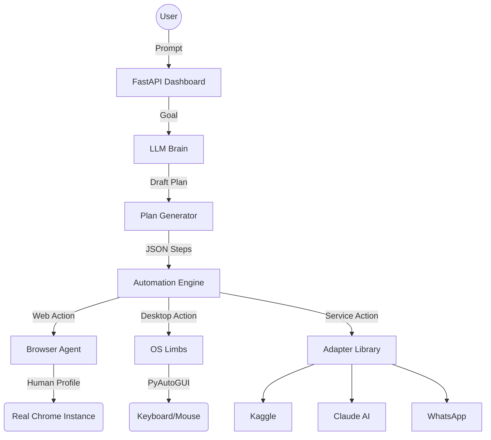

# 🤖 Autobot: The Future of Sovereign Automation

Welcome to the **Autobot** mission control. This project is not just a collection of scripts; it is an ambitious attempt to build a **sovereign digital agent**—a system with a brain (LLM) and real physical limbs (Browser/Keyboard/Mouse) that can navigate the digital world exactly like a human being.

---

## 🎯 The Vision
Most automation today is "brittle." It breaks when a button moves 5 pixels. It fails when it hits a login screen. Our vision is to create an agent that **thinks before it clicks**:
- **Human-Parallelism:** Navigating using real Chrome profiles (`Default` = `daltonomondi588@gmail.com`) with authentic sessions.
- **Visual Intelligence:** Using screenshots on every step to perceive visual truth and eliminate blind navigation.
- **Tool Synergy:** Combining DOM tools, visual perception, and OS desktop controls (mouse/keyboard).
- **Local Sovereignty:** Running entirely on your machine, with your data, using your tools.
- **Core Design Philosophy:** See [DESIGN_PHILOSOPHY.md](file:///c:/Users/User%201/OneDrive/Desktop/projects/django%20projects/personal%20projects/autobot/DESIGN_PHILOSOPHY.md) for full architectural guidelines.

---

## 🚀 Current Milestone: "The Sovereign Hand"
We have achieved a highly robust, unified architecture. The system is now ready for autonomous execution with minimal supervision.

### What works:
- ✅ **Unified Control:** A single `autobot --server` command handles both backend and frontend.
- ✅ **Anthropic Claude Integration:** Direct native support for `ANTHROPIC_API_KEY` via `AnthropicOpenAIAdapter`, eliminating OpenRouter credit costs.
- ✅ **Strict "No Blind Actions" Policy:** Full documentation of visual truth and interactive perceive-reason-act-verify loop in [DESIGN_PHILOSOPHY.md](file:///c:/Users/User%201/OneDrive/Desktop/projects/django%20projects/personal%20projects/autobot/DESIGN_PHILOSOPHY.md).
- ✅ **Extension Mastery:** Real-time visual "Mini-Peek" overlay that tracks the agent across all tabs.
- ✅ **Kaggle Baseline:** Native API support for listing, downloading, and submitting to Kaggle competitions.
- ✅ **Resilient Loops:** Intelligent API-to-UI fallback ensures the agent doesn't give up if an API fails.
- ✅ **OS "Muscles":** Anti-sleep prevention and direct mouse/keyboard control for sites that block automation.

### Robustness Features:
- 🛡️ **Self-Healing:** The agent is instructed to switch from API mode to manual Browser mode if tools fail.
- 🕒 **Background Persistence:** The browser extension syncs state via a background worker, allowing you to monitor progress even if you close the dashboard.
- 📐 **Unified Setup:** `autobot --setup` automatically handles browser installations and environment checks.

---

## 🏗️ Technical Architecture


```mermaid
graph TD
    User((User)) -->|Prompt| API[FastAPI Dashboard]
    API -->|Goal| Brain[LLM Brain]
    Brain -->|Draft Plan| Planner[Plan Generator]
    Planner -->|JSON Steps| Engine[Automation Engine]
    
    Engine -->|Web Action| Browser[Browser Agent]
    Engine -->|Desktop Action| OS[OS Limbs]
    Engine -->|Service Action| Adapters[Adapter Library]
    
    Browser -->|Human Profile| Chrome(Real Chrome Instance)
    OS -->|PyAutoGUI| UserInput(Keyboard/Mouse)
    
    Adapters --> Kaggle[Kaggle]
    Adapters --> Claude[Claude AI]
    Adapters --> WhatsApp[WhatsApp]
```

---

## 🛠️ Setup & Execution

**Start here — before anything else:**
```bash
python -m pip install -r requirements.txt
python -m autobot.cli --doctor   # checks deps, Chrome/CDP, API keys; tells you what's broken
```

> **Do not run `playwright install chromium`.** Autobot drives your *real*
> Chrome — the one with your actual logins to Grok, Overleaf, Gmail — by
> launching it with `--remote-debugging-port` and attaching over CDP. It
> never calls `chromium.launch()`, so Playwright's bundled ~150MB browser is
> never used. If you already tried and hit
> `UNABLE_TO_VERIFY_LEAF_SIGNATURE`, ignore it: that's Playwright's bundled
> Node.js rejecting a TLS-intercepting certificate (corporate proxy or
> HTTPS-scanning antivirus), and it has no effect on Autobot.
`--doctor` makes no LLM calls and costs nothing. Fix every `[FAIL]` before
running a task; `[WARN]` items reduce capability but still allow a run.

**Then run the cheapest possible end-to-end test first:**
```bash
autobot "open Notepad and type hello"
```
This exercises window focus → native UI extraction → `computer_call` in about
four steps, so if something breaks you learn which layer failed. Debugging a
nine-phase benchmark tells you almost nothing by comparison.

**Full setup:**
1. **Bootstrap:** `python -m autobot.main` (Starts server on 8000).
2. **Dashboard:** `npm run dev` in `/frontend` (Opens dashboard on 3000).
3. **Configurations:**
   - Set `AUTOBOT_BROWSER_MODE=human_profile` for stealth.
   - Set `AUTOBOT_LLM_PROVIDER=openrouter` for the brain.

### Controlling token spend

| Variable | Values | Effect |
| :--- | :--- | :--- |
| `AUTOBOT_VISION_MODE` | `always` / `auto` / `never` | `auto` (default) sends a screenshot only on the first step, when the DOM is too sparse to act on, or after a failed action. `always` is the old behaviour and costs roughly 1-2k extra tokens *per step*. `never` is text-only and cheapest, but blind to canvas/image-only UIs. |
| `AUTOBOT_APPROVAL_MODE` | `strict` / `balanced` / `trusted` | How often the agent pauses for permission. IRREVERSIBLE actions (deletion, payments, credentials, sending under your identity) always pause, in every mode. |
| `AUTOBOT_STEPS_PER_OBJECTIVE` | integer | Step budget per mission objective. |

The largest saving isn't a setting: repeated tasks get distilled into
**learned skills** (`autobot/knowledge/skills/`) and replayed instead of
re-reasoned. `autobot --doctor` reports how many you've accumulated.

---

## 🗺️ Roadmap
- [ ] **Conversational Follow-ups:** Allow users to update plans via chat mid-run.
- [ ] **OCR Integration:** Let the AI "read" text directly from pixel screenshots.
- [ ] **Self-Healing:** Automatically try alternative selectors if a click fails.
- [ ] **Collective Intelligence:** Sharing successful workflows via a local JSON library.

---
*Created by the Autobot Core Team. Sovereignty through Automation.*
