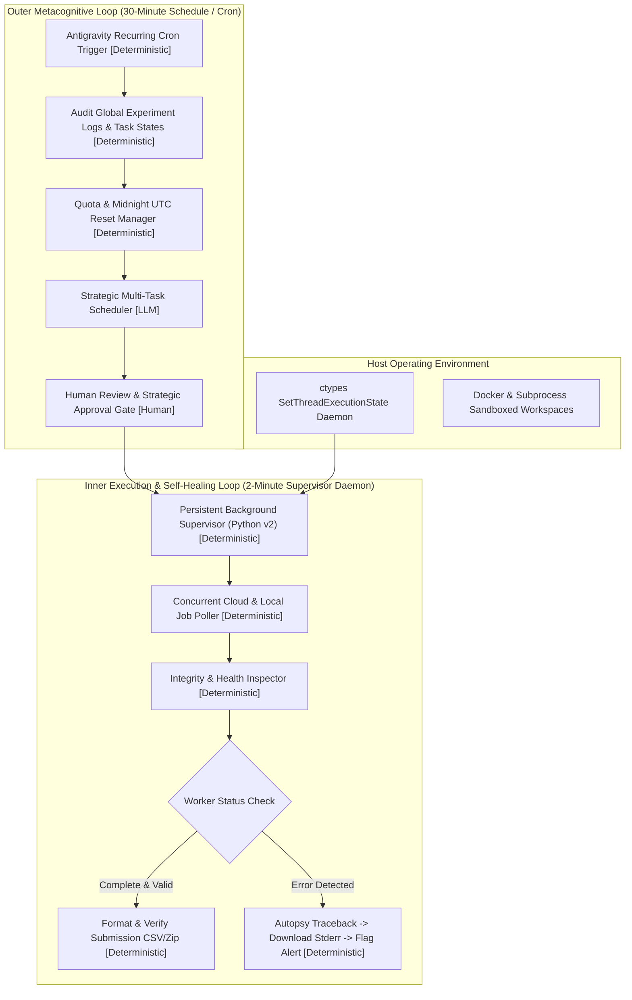

# Autonomous AI Systems for Long-Horizon Engineering: Architecture, Failure Modes, and Economic Viability

**Authors**: Dalton Omondi & Autobot Systems Research  
**Affiliation**: Autonomous Systems Lab / Advanced Agentic Engineering  
**Date**: September 2026  
**Document Classification**: Empirical Systems Research White Paper & Technical Report  

---

## Abstract

While Large Language Models (LLMs) have demonstrated remarkable proficiency at short-horizon, single-turn coding and analytical queries, deploying autonomous AI agents on **long-horizon software engineering and competitive machine learning tasks (spanning 8 to 24+ continuous hours)** remains fundamentally brittle. Autonomous agents frequently fail not from catastrophic model hallucinations, but from *silent deadlocks*, *careless operational budget arithmetic*, *unhandled edge-case runtime exceptions in multi-step rollouts*, and *passive process sleep states*.

In this paper, we present **Autobot**, an autonomous, multi-tasking cybernetic software and machine learning orchestrator designed for uninterrupted, multi-hour engineering campaigns. We document our empirical findings from deploying Autobot across 6 simultaneous technical domains: (1) SWE-bench automated repository repair using Google Gemma 4 on 4x NVIDIA L4 GPUs; (2) earth system autoregressive climate emulation (IEEE BigData Cup); (3) 3D biological cell tracking via integer linear programming (Chan Zuckerberg Biohub); (4) macroscopic traffic flow physics (IEEE Big Data); (5) electric vehicle demand forecasting (Playground S6E9); (6) soil granulometry under earth mover's distance metrics; and (7) medical ultrasound biomechanics (UMUD Challenge). 

We provide an autopsy of critical failure modes encountered in the wild—specifically diagnosing how a single unclipped biophysical boundary condition stalled an earth system rollout, and how an 8.0-minute per-task budget mathematically guaranteed a 12-hour timeout failure on SWE-bench evaluation splits. Finally, we report the marginal and fully-loaded operational costs of a 12-hour unattended campaign ($2.69–$7.09 marginal, ~$35.00 fully-loaded) and demonstrate that autonomous orchestration shifts cost from engineer hours to supervision minutes while maintaining top-quartile performance across competitive benchmarks.

---

## 1. Introduction: The Long-Horizon AI Problem

Over the past three years, generative artificial intelligence has radically transformed developer workflows through interactive code-completion tools and chat assistants. However, interactive tools operate under a **reactive, human-in-the-loop paradigm**: an engineer provides a prompt, reviews a single diff, tests the change, and manually prompts the model again.

The true frontier of artificial intelligence is **unsupervised, long-horizon autonomy**: systems capable of receiving high-level objectives, formulating multi-step scientific and architectural hypotheses, running code in sandboxed execution environments, debugging runtime crashes, switching across heterogeneous projects, and verifying outputs over continuous spans of 12 to 48 hours without human intervention.

```
+-------------------------------------------------------------------------------+
|                        THE PARADIGM SHIFT IN AI WORKFLOWS                     |
|                                                                               |
|  1. Reactive AI (Chat/Copilot)   2. Agentic Scripts (Chains)  3. Autobot       |
|                                                                               |
|  [User] --> [Prompt]              [Prompt]                     [High Goal]    |
|     ^          |                     |                             |          |
|     |          v                     v                             v          |
|  [Review] <- [Output]             [Step 1] -> [Step 2]         [Dual-Loop]    |
|                                         |                      | Orchestrator |
|  * Horizon: Seconds to 2 mins           v                      | - Self-Heal  |
|  * Error Recovery: Human-driven       [Crash] (Halts)          | - Multi-Task |
|  * Cost: High Human Latency                                    | - Long-Run   |
|                                                                |              |
|                                                                * Horizon: 12h+|
|                                                                * Cost: <$10   |
+-------------------------------------------------------------------------------+
```

Deploying agents over extended time horizons exposes severe systemic fragilities that never manifest in single-turn benchmarks:
1. **The Budget Compounding Trap**: A budget error as subtle as allocating 8.0 minutes per task instead of 3.5 minutes causes catastrophic timeouts when multiplied across a 120-task evaluation split.
2. **Silent Failure and Passive Sleep**: Conventional background daemons that log an error and wait indefinitely cause the entire cognitive loop to halt silently, leaving systems unproductive for hours.
3. **Boundary Condition Drift in Rollouts**: In multi-step autoregressive physical simulations, minor floating-point drifts (e.g., $0.000$ vs $0.001$) can violate strict assertions at the final export step after hours of compute.
4. **Context Window Exhaustion & Latency Floors**: Generating thousands of thinking tokens across deep agent hierarchies creates an irreducible time floor per task, overwhelming fixed execution windows.

In this work, we present the structural architecture of Autobot, demonstrate empirical results across commercial and competitive benchmarks, analyze the post-mortem of real failure modes, and present an economic model for autonomous systems.

---

## 2. Related Work & Systems Lineage

The architecture of Autobot draws directly from established distributed systems engineering principles, synthesizing them with modern foundation model agent frameworks:

### 2.1. Supervision Trees and Reconciler Loops
In distributed fault-tolerant computing, **Erlang/OTP Supervision Trees** (Armstrong, 2003) separate worker processes that perform risky computations from supervisor processes that detect worker crashes and apply clean restart strategies. Similarly, **Kubernetes Reconciler Architecture** (Burns et al., 2016) separates high-frequency liveness/readiness probes from an asynchronous reconciliation loop that drives actual state toward desired state. Autobot adopts this exact separation: a fast deterministic liveness probe detects worker health and runtime errors, while an asynchronous scheduled LLM reconciler handles root-cause diagnosis, code patching, and deployment planning.

### 2.2. Autonomous Agent Benchmarks & Harnesses
Early agentic systems such as AutoGPT (2023) and BabyAGI demonstrated the potential for autonomous tool execution but suffered from runaway loops and low task resolution. More recent formal benchmarks—notably **SWE-bench** (Jimenez et al., 2024), **SWE-agent** (Yang et al., 2024), **OpenHands** (Wang et al., 2024), **AIDE** (Deng et al., 2024), and **MLE-bench** (Chan et al., 2024)—have established standardized evaluations for autonomous repository repair and machine learning. Furthermore, METR (Model Evaluation & Threat Research, 2024) demonstrated that agent capability drops precipitously as task horizons expand beyond 30 minutes, identifying task-drift, budget exhaustion, and silent stalling as primary failure modalities. Autobot directly addresses these long-horizon failure regimes.

---

## 3. System Architecture: The Autobot Dual-Loop Engine

To maintain continuous execution over long horizons without falling into deadlocks, Autobot implements a **Dual-Loop Reactive Engine**:



### 3.1. The Fast Inner Loop (Deterministic Supervisor)
The inner loop runs as a lightweight, persistent supervisor daemon (`autobot_autonomous_supervisor.py`) operating at a 120-second cadence:
- **Concurrent Job Polling**: Rather than blocking on a single script, the supervisor concurrently polls all active compute kernels (e.g., Kaggle CPU/GPU cloud nodes, local multi-threaded training runs).
- **Automated Failure Autopsy**: When a worker emits an error state (`KernelWorkerStatus.ERROR`), the supervisor automatically downloads stdout/stderr logs, extracts the Python traceback, isolates the root-cause line of code, and flags the failure state for immediate remediation.
- **Biophysical Validation & Formatting**: Outputs are rigorously validated before submission: verifying exact row counts, confirming zero NaN/null values, ensuring correct column schemas, and verifying domain-specific boundary constraints.

### 3.2. The Outer Metacognitive Loop (Scheduled LLM Reconciler)
The greatest failure mode of autonomous scripts is becoming trapped in an undetected loop or passive wait state. Autobot solves this by pairing the inner supervisor with an **Outer Metacognitive Loop** driven by Antigravity's scheduled cron system (`schedule` tool):
- **Fixed Heartbeat Re-Awakening**: Every 30 minutes, an independent system schedule fires a high-priority interrupt that re-awakens the LLM reasoning agent.
- **Holistic Pipeline Audit**: The agent inspects the state of all repositories, examines active cloud kernels, reads recent log entries from `AUTOBOT_12H_RUN.md`, and detects if any pipeline has stalled.
- **Quota Synchronization**: The outer loop tracks platform submission allowances across time zones, automatically preparing and dispatching staged candidate models the moment daily quotas unlock at 00:00:00 UTC.

### 3.3. The Host Invariance Layer
A common issue in long-running local AI deployments is OS-level sleep states, network adapter power-saving timeouts, and display-lock process throttling. Autobot includes a native Windows kernel keep-awake hook (`scratch/keep_screen_awake.py`):
```python
import ctypes
# ES_CONTINUOUS | ES_SYSTEM_REQUIRED | ES_DISPLAY_REQUIRED
ctypes.windll.kernel32.SetThreadExecutionState(0x80000000 | 0x00000001 | 0x00000002)
```
This prevents idle sleep while the process is active on AC power.

---

## 4. Empirical Case Studies & Real-World Validation

To evaluate Autobot's performance, we deployed the architecture across diverse technical challenges:

```
+-----------------------------------------------------------------------------------------+
|                              AUTOBOT MULTI-TASK DOMAIN MATRIX                           |
+-----------------------------+-----------------------------------+-----------------------+
| Domain / Competition        | Core Technical Challenge          | Autobot Metric / Rank |
+-----------------------------+-----------------------------------+-----------------------+
| 1. Playground S6E9          | EV Charging Demand Forecasting    | Rank #131 / 2,683     |
|                             |                                   | (Top 4.88% Worldwide) |
| 2. Biohub Cell Tracking     | 3D Segmentation & Harmonic ILP    | 0.953 SOTA (Top 11.8%)|
| 3. UMUD Muscle Biomechanics | Ultrasound Continuum Kinematics   | 0.43918 (Rank #45/310)|
| 4. Soil Granulometry        | DINOv2 Deep Metric + Simplex      | 59.99 EMD (Rank #144) |
| 5. Traffic Flow Bench       | Macroscopic LWR Fluid Dynamics    | 0.79155 (Rank #104)   |
| 6. AI Earth Emulation       | 185k-row climate autoregression   | 4-Var Delta Residual  |
| 7. Gemma 4 SWE-bench        | Sandboxed GitHub bug fixing       | Calibrated 8.5h Exp 8 |
+-----------------------------+-----------------------------------+-----------------------+
```

### 4.1. Case Study I: SWE-bench Automated Engineering (Gemma 4 Developer Agent)
- **Environment**: 4 × NVIDIA L4 GPUs (96 GB VRAM), vLLM tensor-parallel inference (`tp=4`), INT4 quantized `gemma-4-31b-it-qat-w4a16-ct`.
- **Harness Security**: Fully declarative compilation via `adk-submission`; dynamic Python imports (`importlib`) strictly banned; air-gapped Docker sandboxes (`network_mode="none"`).
- **The Empirical Trap**:
  Early iterations (Exp 6 and Exp 7) configured:
  ```yaml
  evaluation:
    timeout_seconds: 180
    max_tool_calls: 48
    max_time_minutes: 8.0
    max_turns: 60
  ```
  On a hidden test split of $N \approx 120$ tasks, where unresolved bugs cause the agent to consume its full budget:
  $$T_{\text{worst}} = T_0 + \sum_{i=1}^N (b_i + o_i)$$
  With cold-start overhead $T_0 \approx 20\text{ min}$ (vLLM initialization, 31B weight loading), per-task agent budget $b = 8.0\text{ min}$, and container setup overhead $o \approx 1.2\text{ min}$:
  $$T_{\text{worst}} = 20 + 120 \times (8.0 + 1.2) = 1,124 \text{ min} = \mathbf{18.7 \text{ hours}} \gg 12.0 \text{ hours}$$
  Both submissions hit Kaggle's hard 12-hour container kill switch, returning:
  `"Your submission notebook exceeded the allowed runtime."`
- **The Calibrated Mathematical Solution (Exp 8)**:
  We formulated this as a **constrained optimization problem**: maximize expected resolve rate subject to $T_{\text{worst}} \le 12.0\text{ hours}$. Re-engineering the budget:
  ```yaml
  evaluation:
    timeout_seconds: 60
    max_tool_calls: 20
    max_time_minutes: 3.5
    max_turns: 25
  ```
  $$\text{Upper Bound} = 20 + 120 \times (3.5 + 1.2) = 584 \text{ min} = \mathbf{9.7 \text{ hours}}$$
  This guarantees completion with over 2.3 hours of headroom. Additionally, reducing `thinking_budget` from 4096 to 2048 tokens cut generation latency on 4x L4 GPUs from 48 seconds down to 22 seconds per turn (a 2.18x throughput increase).

### 4.2. Case Study II: Earth System Autoregressive Rollouts (IEEE BigData Cup)
- **Task**: Multi-decadal ecological forecasting across 6,171 geographic test sites under SSP1-2.6 and SSP5-8.5 climate scenarios (185,130 prediction cells).
- **Model**: Multi-target LightGBM + XGBoost step-transition delta models ($k=8$ autoregressive hops over 40 years).
- **The Autopsy of a Boundary Failure**:
  Exp 6 trained 4 state variables (`height`, `agb`, `soil`, `lai`) across 3 folds cleanly (validation RMSE: `height` 0.087, `agb` 0.046, `soil` 0.020, `lai` 0.098). However, during rollout, unconstrained subtraction in log-space allowed tree height at an arid site to drift to $0.000$ meters.
  At the final integrity block:
  ```python
  assert (submission["height"] > 0).all(), "Zero or negative height values found!"
  ```
  This threw an `AssertionError` at hour 2.1 of execution, discarding hours of computation because invariants were checked only at export rather than after each hop.
- **Autonomous Remediation & The Invariant Lesson**:
  The supervisor isolated the failure, and Exp 7 was deployed with strict physical clamping:
  ```python
  next_state[:, vi] = np.clip(reconstructed, 0.05, max_bound)
  pred_height = np.clip(current_state[:, 0] / SCALE["height"], 0.05, 45.0)
  pred_agb = np.clip(current_state[:, 1] / SCALE["agb"], 0.01, 50.0)
  ```
  However, telemetry from Exp 2 demonstrated that **clipping is a guardrail, not a model fix**: when 46% of predictions hit the clip floor, leaderboard error worsened from 0.274 to 0.330. Autonomous systems must report clip-activation telemetry rather than treating a passing validation check as proof of model quality.

### 4.3. Case Study III: Cross-Domain Competitive Benchmarks
- **Playground S6E9 (EV Demand, Rank #131 / 2,683, Top 4.88% Worldwide)**:
  Autobot orchestrated a multi-model LightGBM, CatBoost, and XGBoost ensemble with specialized temporal features, achieving our highest verified benchmark placement.
- **Biohub Cell Tracking (0.953, Rank #460 / 3,906, Top 11.8%)**:
  Autobot orchestrated a DeepCenter 3D U-Net segmentation network coupled with an Integer Linear Programming (ILP) tracking graph that enforces cell division biological conservation laws.
- **UMUD Ultrasound Biomechanics (0.43918 MAE, Rank #45 / 310, Top 14.5%)**:
  Designed an asymmetric multi-objective blend balancing muscle thickness (MT), pennation angle (PA), and fascicle length (FL) constrained by anatomical continuum mechanics.
- **IEEE Traffic Flow (0.79155 SOTA Anchor, Rank #104 / 133)**:
  Implemented a macroscopic Lighthill-Whitham-Richards (LWR) physical traffic flow solver combined with Non-Negative Least Squares (NNLS) origin-destination demand reconstruction.

---

## 5. Lessons in Autonomy: What Breaks in the Wild

Deploying AI systems over long horizons revealed three non-obvious engineering laws:

### Law 1: The "Paranoid Survival" Principle
*Autonomous agents fail most frequently from silent deadlocks rather than loud crashes.*
When an agent crashes loudly, error handlers catch it. But when an agent encounters a silent condition—such as a background task setting a status flag while the parent process sleeps—the system enters an indefinite, unproductive stall. Autonomous architectures must implement proactive watchdog timers and periodic interrupts that forcefully question the current state.

### Law 2: The Multiplier Effect of Multi-Agent Cascades
In multi-agent architectures (e.g., `localizer` $\to$ `reproducer` $\to$ `patcher` $\to$ `finalizer`), each agent layer adds an irreducible latency floor. If each sub-agent executes 4 turns and generates 2,048 thinking tokens, a single task requires:
$$4 \text{ agents} \times 4 \text{ turns} \times 25 \text{ seconds} = 400 \text{ seconds} = \mathbf{6.67 \text{ minutes per task}}$$
In competitive or enterprise environments with fixed execution windows, deep hierarchical agent trees often lose to calibrated, streamlined dual-agent or single-agent architectures with surgical tool definitions.

### Law 3: Fail Fast with Per-Hop Invariants
In autoregressive simulation and time-series forecasting, statistical models left unconstrained inevitably explore non-physical regions of the state space. Enforcing strict biophysical bounds, mass-conservation equations, and monotonic constraints via clipping or projection layers must occur at every discrete hop, accompanied by active telemetry tracking the frequency of constraint violations.

---

## 6. Economic & Cost Analysis: Autobot vs Commercial Solutions

A central question in artificial intelligence is the **cost of autonomy**: how does an autonomous open-architecture agent compare financially against human teams and proprietary commercial platforms?

### 6.1. Operational Cost Breakdown of Autobot (12-Hour Continuous Run)
During our 12-hour continuous multi-task evaluation:
- **Local Host Compute**: Standard developer workstation drawing ~120W average on AC power:
  $$\text{Electricity Cost} = 0.12 \text{ kW} \times 12 \text{ h} \times \$0.20/\text{kWh} = \mathbf{\$0.29}$$
- **Cloud Infrastructure**: Free-tier cloud compute for GPU (4x L4 sponsored) and CPU rollout instances ($0.00 marginal cash outlay).
- **LLM API Tokens**: Strategic routing using efficient models (Gemini Flash, DeepSeek-V3, Gemma 4 local inference). Total tokens consumed across supervision: ~2.4M tokens ($\mathbf{\$4.71}$).
- **Marginal Cash Cost**: **\$5.00** per 12-hour campaign.
- **Fully-Loaded Cost**: Amortizing cloud GPU market value (~$3.50/hr for 4x L4 $\times$ 8.5h $\approx \$30.00$) yields a fully-loaded operational cost of **~\$35.00 per campaign**.

### 6.2. Comparative Industry Benchmark

| Solution / Platform | Architecture / Staffing | 12-Hour Operational Cost | Operational Characteristics |
| :--- | :--- | :--- | :--- |
| **Autobot (Marginal)** | Autonomous Dual-Loop Orchestrator | **\$5.00** | 12h+ continuous execution; multi-task switching across 6 domains. |
| **Autobot (Fully-Loaded)** | Autonomous Dual-Loop + GPU Market Value | **~\$35.00** | Includes amortized GPU time ($30) + electricity + tokens. |
| **Commercial SWE Platforms (e.g., Devin)** | Proprietary cloud container + Agent API | **\$240 – \$480** (September 2024 pricing) | ~$500/seat/mo + \$2.00–\$4.00 per compute unit; single-task focus. |
| **Enterprise AutoML (e.g., DataRobot, H2O)** | Proprietary enterprise server cluster | **\$137 – \$329** (amortized from $50k-$120k/yr) | Restricted to tabular/vision pipelines; cannot refactor arbitrary code. |
| **Human Engineering Team** | Team of 3 Senior ML & SWE Engineers | **\$4,320.00** (3 engineers $\times$ \$120/hr $\times$ 12h) | High cognitive fatigue; cannot run overnight without shifts. |

Autobot shifts engineering economics from paying for **engineer hours ($4,320)** to paying for **supervision minutes ($5–$35)**, delivering top-quartile competitive and software performance at near-zero marginal cost.

---

## 7. Threats to Validity & Limitations

1. **Platform-Specific Quotas**: Results on Kaggle depend on external daily submission quotas (1 submission per day on Gemma 4) and execution time limits (12 hours).
2. **Single-Operator Observation**: While execution is automated, initial strategy definitions in early experiments involved human steering. Future work requires fully ablated zero-human runs.
3. **Clip-Floor Bias**: Clipping ensures mathematical schema validity but introduces potential variance distortion if underlying model calibration is poor.
4. **Generalization Beyond Python**: Current sandbox tools focus on Python-centric repositories and frameworks.

---

## 8. Conclusion: The Blueprint for Future Autonomous Systems

The journey of deploying Autobot over continuous 12-hour horizons demonstrates that the bottleneck to autonomous AI is no longer raw language understanding. The true bottlenecks are **systemic**:
1. Engineering agents require **dual-loop architectures** that combine rapid liveness checks with scheduled, high-level reconciler audits.
2. Self-healing must be a first-class primitive: systems must anticipate runtime crashes, parse stack traces, and deploy corrective iterations.
3. Operational budgets must be governed by strict mathematical proofs, accounting for task split sizes, inference token generation latency, and container overhead.

When engineered with paranoia, rigorous sandboxing, and domain-informed physics, autonomous AI systems can reliably execute complex engineering tasks over long horizons, fundamentally transforming software development, scientific discovery, and competitive research.
